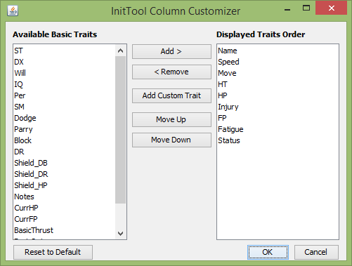
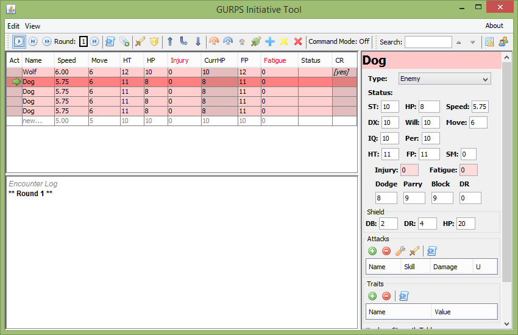

Customizing Columns
===================

The columns displayed in both the initiative table in the main window and the group table in the group manager can be customized. You can get to the customization dialog either through the 'View' menu or by right clicking on the table header and selecting 'Customize Columns'. This will bring up the following dialog:

Using the Column Customizer dialog, you can select which combatant traits are displayed as columns in the table you are customizing. The initial list of available traits are those that are guaranteed to be present for every combatant.

You may add columns for additional traits by clicking the 'Add Custom Trait' button. These columns show whether or not a particular combatant has that trait, or it's value if it has one. For example, you can add a column for the trait 'Combat Reflexes' (or 'CR'). Custom traits will be removed from the list if they are not displayed.

.. note:: Trait names are case sensitive. Short form aliases are supported (such as 'HPT' for 'High Pain Threshold'). A list of aliases can be found in :ref:`trait-aliases`.

	   
.. note:: Columns can also be temporarily re-ordered by dragging the header cell. This method of ordering is not saved between runs.

.. note:: Certain traits cannot be edited from the table. This includes traits that are calculated from other traits, custom traits, and the 'Notes' field. This restriction is indicated by tinting the cell gray.
