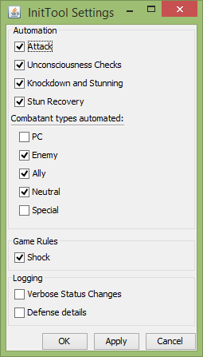
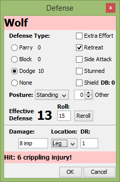
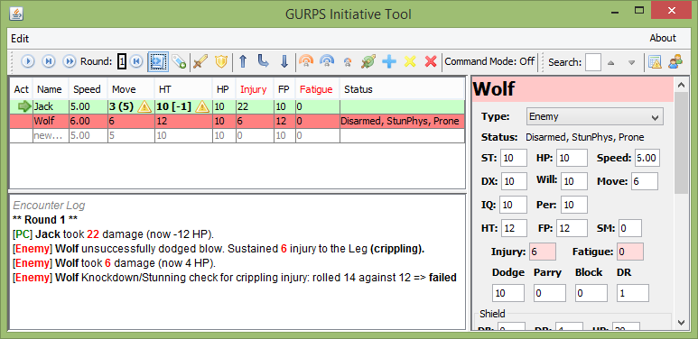

Combat Tracking
=================

Automation
----------

Only combatants with NPC types are subject to automation. NPC types are ally, neutral, and enemy. Special and PC types are not automated. Each automation function can be controlled through the Settings dialog, which is accessible under the Edit menu of the main window.

Attack
~~~~~~
NPCs with the 'Attacking' status that are not otherwise disabled or stunned will make their default attack at the start of their turn. Keep in mind that the attack is only printed to the log.

Unconsciousness Checks
~~~~~~~~~~~~~~~~~~~~~~
If an NPC is at 0 or fewer remaining HP, they make a consciousness roll at the start of their turn (before attacking, if enabled). If they fail their status is set to Disarmed, Prone and Unconscious and their turn is skipped.

Knockdown and Stunning
~~~~~~~~~~~~~~~~~~~~~~
The Defense dialog prints Knockdown/Stunning calculations to the log. If this option is set, the results of those calculations are applied to NPCs.

Stun Recovery
~~~~~~~~~~~~~
NPCs with mental or physical stun statuses will make checks at the start of their turn to recover. If they have the 'StunRecover' state, then they will automatically lose that state at the start of their next turn.

Attacks
-------

Besides the attack automation, attacks can be triggered manually as well. Both the toolbar attack button and the initiative table right-click menu attack option cause all selected rows to report their default attack. The Attacks section of the detail panel also has an attack button which triggers the selected attack in the table.

When attacks are reported, they do not trigger any further automation to apply the results to a target. This must be done manually or through the defense dialog.

Attacks take into account the current position, and shock if that option has been enabled under automations.

.. note:: Shock caused by damage is tracked by the tool even if the option to apply it to attacks is disabled. You can see the tracked values in the Temp/Debug section of the details panel. 

Defenses
--------

.. image:: _static/21_defense_dialog.png
   :align: left

Pressing the shield button or selecting the 'defend' right-click menu option brings up the Defense dialog. This is a very useful tool for speeding defense evaluation and/or injury calculation. Keyboard shortcuts are available for most operations, and can be discovered in the tooltips.

The top half of the dialog handles defense evaluation. Each defense is calculated based on the base value and how many times it has been used this turn (for Parry and Block) or the current injury/fatigue level (for Dodge) with the best defense initially selected. Defense options and modifiers are on the left side. The current posture is selected and the 'Shield' option is initially selected if its DB is greater than 0.

The bottom section deals with damage and injury. Damage is accepted in many forms: '9', '12 (2) pi', or a die expression like '2d+2 cr'. Note that the damage type is assumed to be 'cut' if not specified. DR is copied from the main sheet. All basic hit locations and some extended locations are available and fully modeled.

Injury calculation is comprehensive. Penetrating basic damage is converted to injury based on the location and any injury tolerances, then limited by the crippling thresholds for extremities.

.. note:: Crippling injury to an eye is not reported.
.. note:: Posture is not automatically modified for crippling injuries.

Any part of the defense calculation can be modified and the results will be immediately updated to show the results. Once you are done, the ESC key or Cancel button will discard the results while the Enter key or OK button will accept them. Any injury and/or fatigue (for extra effort usage) will be applied to the defender and log messages printed showing the details, including knockdown/stunning calculations if approprite.

.. note:: Death checks from damage are not currently reported or automated by the tool. The penalty to consciousness checks in the HT column of the initiative table can be used to track when HP thresholds are crossed.

Shields
~~~~~~~
The Damage to Shields rules are used: if the margin of success on a defense is less than the DB of a shield used in that defense the the blow is considered to have squarely hit the shield, and may damage it or even penetrate to hit the defender.

.. image:: _static/24_defense_shield.png
   :align: left
	   
Cover DR of the shield is calculated and applied to the damage, and then any excess damage ('overpenetration') is applied to the selected hit location.

Injury to the shield is also calculated and tracked in a simplified manner. Basic damage to the shield is limited to its base HP/4, matching the cover DR calculation. Injury to the shield is calculated assuming the Injury Tolerance:Homogenous trait. Once a shield's current HP is reduced to 0, the shield defense option will no longer be selected by default. The current stats of a shield are shown in the tooltip of the shield defense option.

.. note:: On a shield hit the defender hit location for any penetrating damage is not changed to the arm automatically.

