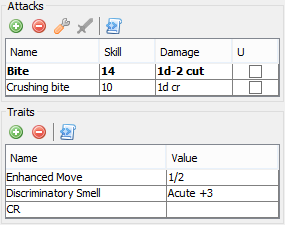

Combatants
++++++++++

Each combatant is described by a number of various statistics, some of which are for the GM's reference and some of which affect the program's basic operations and automations. This section describes both how to modify those stats and how they function within the program.

Editing a combatant is usually most easily done within one of the detail panels. The only piece of information which cannot be edited in the detail panel is the 'Status' field, which must be changed using either the table cell editor, the right-click menu, or the toolbar buttons.

Editing Combatants
==================

Input Checking
--------------

Most input fields will allow any value to be entered, but turn red if the current value is not of the expected format. Because this check is done as you type, a field may turn red while you are in the process of inputting a valid entry (such as on '4/' while entering '4/2' in a DR field). Edits in table cells can be canceled by pressing the ESC key. Other fields do not have this capability, but you can use the undo functionality to revert them to the previous value.

  
The Initiative Table
--------------------

The initiative table is fully editable. The status cell displays a list box when clicked which allows multiple status changes to be made. A right-click menu in the table provides additional editing options, and most apply to all selected rows. This menu provides the only way of deleting rows. Status changes made through this menu are done in a coordinated fashion, so it is a useful way to get all the selected rows the the same state.

Special editing function is enabled for the Injury and Fatigue columns. If you press a number, '+/=' or '-' key while one of those fields is selected, it will start entry of a delta value to be added or subtracted from the previous one (a number starts an add). These fields can parse simple +/- expressions such as '3+4-2'.

.. image:: _static/30_table_status_display.png

Additional information is also provided for the Move and HT fields based on the current Injury and Fatigue values. Move shows the reduction from high injury or fatigue, with the orignal value in parentheses. HT shows the current penalty for consciousness checks in brackets after the HT value. Icons also provide a visual flag to the condition.

The format of the row is also modified based on Type and Status, as described above.

Toolbar
-------

There are several buttons along the top toolbar which allow for quick status changes to selected rows, quite useful during an encounter. The posture buttons set all selected rows to the specified posture, while the other status buttons toggle the chosen state for each row individually. 

Combatant Stats & Traits
========================

Type and Status
---------------

'Type' and 'Status' are two special pieces of information not normally found on a GURPS character sheet. They help drive the automation and tracking functions for characters in a combat situation.

'Type' is simply a categorization of whether the creature is a PC, Ally, Neutral, Enemy, or something Special. The NPC types Ally, Neutral, and Enemy are impacted by automation functions while the PC and Special types are not. The character is also color-coded based on the type in many places. Other than NPC  automation and color coding, the specific type has no impact on the program operation.

'Status' indicates special effects that impact what options and penalties a combatant has. It includes things like stun, posture, and unconsciousness. Each status impacts how the combatant is treated, especially for automated NPCs.

The statuses are:

- **Attacking**: NPC types not otherwise disabled will automatically attack
- **Disarmed**: Informational only, this status is automatically applied when an NPC suffers knockdown/stunning after a failed defense
- **StunPhys**: Physical stun. NPCs skip their normal turn and check for recovery with an HT roll
- **StunMental**: Mental stun. NPCs skip their normal turn and check for recovery with an IQ roll
- **StunRecovr**: Recovering from mental stun, NPCs will automatically finish recovering at the start of the next turn.

- **Waiting**: Table display right justified. Turn skipped automatically. Tag update will not modify any present tag.
- **Disabled**: Generic disabled state. Greyed out in table. Turn skipped automatically. Tag update will remove tag.
- **Unconscious**: Indicates unconsciousness. Otherwise identical to **Disabled**
- **Dead**: Dead. As **Disabled**
  
- **Kneeling**: Posture. Impacts attacks and defenses.
- **Prone**: Posture. Impacts attacks and defenses.

Basic Stats
-----------

Some of the basic stats shown in the details panel are for reference only, and are not used by the program. These include ST, DX, Will, Per, Speed, and SM. The others are used as appropriate for calculating current move/dodge, shock, HT penalty for unconsciousness checks, and more.

DR supports split stats for differing effectiveness vs. crushing damage. For example '4/2' for typical mail.

Any change to Injury and Fatigue during an encounter is also listed in the log. The value of these traits is not allowed to be less than 0.

Shield
~~~~~~

Shield damage and cover DR is modeled in the Defense dialog, so full shield stats including DB, DR and HP are included. Default values are based off of a generic medium shield from Low Tech.

Attacks
-------

Multiple attacks can be listed for each creature. The default attack, used when the 'Attack' button is pressed or the auto-attack is triggered, is shown in bold and set by selecting a row and pressing the wrench icon. Each attack is defined through a name (not required to be unique), skill (integer value enforced), damage, and unbalanced indicator.

- **Damage**: Accepts most damage formats. '1d', '1d+2 cr', '5', '1d-1 (2) pi+ ex' are all recognized. The default damage type is cutting. The general form is "XdY+Z [(
)] [<type>] [ex]". Type must be in the shortened form (cr/cut/imp/burn/etc.). As with other fields, the text will turn red if the program does not recognize the string entered as a valid damage expression. Note that 'ex' damage only currently impacts injury to Diffuse creatures (see the Injury Tolerance trait, below).
- **Unbalanced**: If an unbalanced attack is used, it counts towards the number of parries done this turn, impacting the parry defense.

Traits
------

Any other traits can be specified in the Traits table. This can be used for Skills, Advantages, Disadvantages, or anything else you wish to include. There are some special traits which are used by certain of the automation functions. Names are case sensitive, and include a short alias that can be used instead of the full name. They are:

- **Combat Reflexes** (CR): Impacts mental stun recovery. Defenses are assumed to already include the +1 bonus from this. (Note: value is not used)
- **High Pain Threshold** (HPT): Knockdown/stunning checks and shock calculation. (Note: value is not used)
- **Low Pain Threshold** (LPT): Knockdown/stunning checks and shock calculation. (Note: value is not used)
- **Injury Tolerance** (IT): Injury calculation in Defense dialog. Value is a ';' separated list and can include all the options from the Basic Set: No Brain; No Eyes; No Head; No Neck; No Vitals; Diffuse; Homogenous; Undead. Value is case-insensitive.
