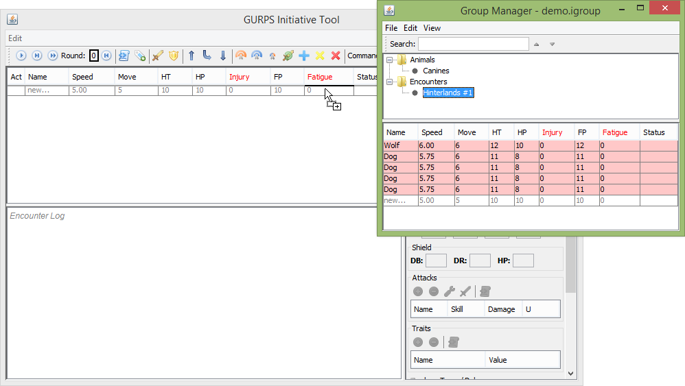

Groups Manager
==============

The groups manager allows you to organize and save combatant records between sessions, making them more easily available to quickly create an encounter during a game session. It is accessed through the 'Window' menu, by cliking the icon depicting two characters on the far right of the toolbar, or by pressing Alt+G.

.. image:: _static/10_group_manager.png

There are three major components in the Groups Manager- at the upper right is the tree view which organizes folders and groups. Below that is the group table which displays the combatants in the currently selected group and to the right is the combatant details pane.

Various customizations of this view are available in the 'View' menu, including showing or hiding the details pane, automatically re-sizing the table columns when switching groups, and changing the columns displayed in the group table.

Managing Groups
---------------
To create folders and groups, right click on the tree view window and select one of the options. The right-click menu can also be used to rename or delete folders or groups. 

Once you have created a group, you can begin adding combatants by selecting the group and then editing the 'new...' row in the group table below. This table has most of the same functionality of the initiative table in the main program window as does the details panel on the right.

.. image:: _static/11_new_group.png

Organizing the tree view is primarily done through dragging the folders or groups to their new location. You can also copy combatant records between groups by selecting and dragging them from the table to the destination group in the tree above.

.. note:: Hitting the 'ESC' key during any drag operation will cancel it.
	  
.. image:: _static/12_group_copy.png

File Operations
~~~~~~~~~~~~~~~
The 'File' menu allows you to save or open group manager records, which by default are named with the '.igroup' extension. You will typically only need one file as you can organize many records using the tree structure.

.. note:: The last loaded file is automatically re-loaded when the program starts.

.. note:: Closing the Group Manager will not discard any changes. If you attempt to close the main initiative window without saving, a pop-up will show and warn you of the unsaved changes. 

GCA4 Import
~~~~~~~~~~~
Within the file menu is also an option to import characters from Gurps Character Assistant 4 (GCA4). This option is not yet fully developed and may not properly import all aspects of a character.

The imported combatants will be put in the currently selected group, or a new group named 'GCA4Import' if none is selected.

.. note:: The file selection dialog for importing allows multiple files to be selected and imported at the same time.

Using Groups
------------

Adding combatants from the Group Manager to the initiative table is done by dragging and dropping. There are two options: first, you can drag an entire group from the tree view to the initiative table. Second, you can select rows from the group table in the group manager and drag them across to the initiative table. You can also do this in reverse, for example if you want to save an un-finished encounter for next session.

