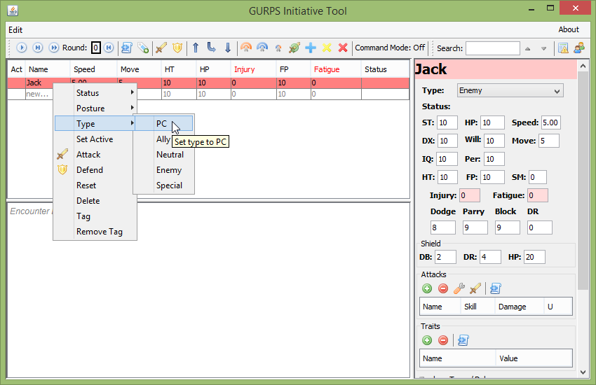
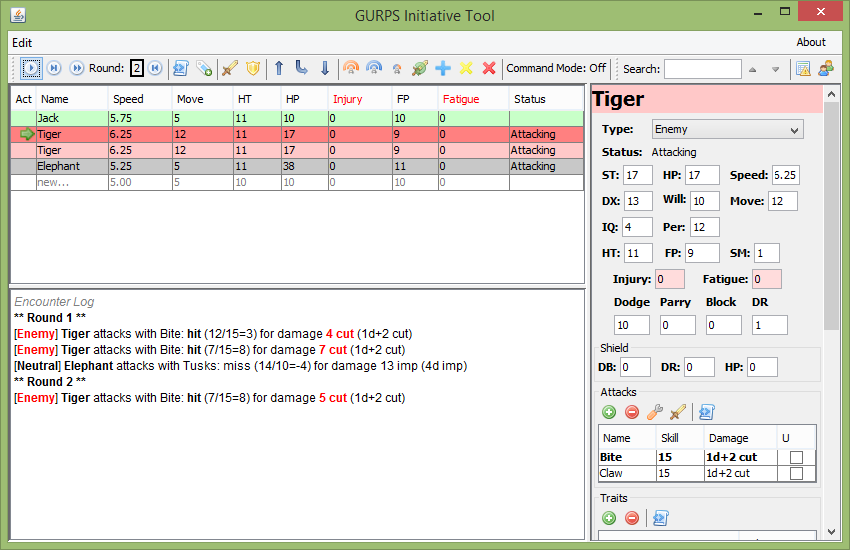
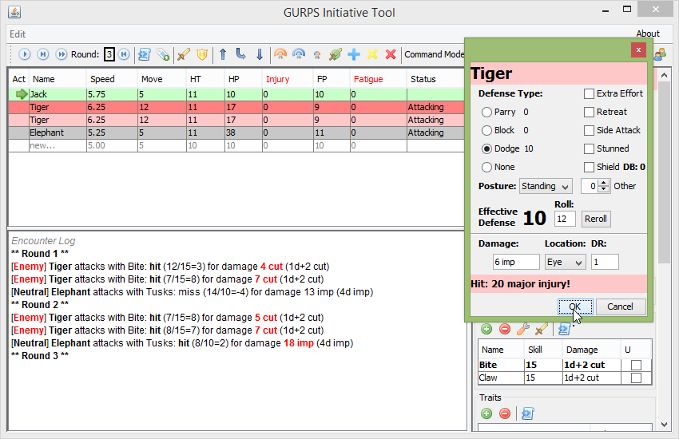

Basic operation
===============

When first starting GURPSInitiativeTool you will see a window looking something like this:

.. image:: _static/01_start_screen.png

Below the menu and the toolbar, the main window is broken up into three sections: the initiative table is on the right above the log area, and a combatant details panel is on the right. Nearly every button has a tooltip which describes its function and any shortcut associated with it.

Encounter Setup
---------------

Adding combatants
~~~~~~~~~~~~~~~~~
Adding new combatants is done by making a change to any cell of the 'new...' row in the initiative table (just above the cursor in the above screenshot). This will insert a row above the 'new...' row and automatically select it.

Editing combatants
~~~~~~~~~~~~~~~~~~
The top selected combatant's details are shown in the right pane and both the table and the details pane can be used to edit combatants. Right-clicking on the table will bring up a menu which can be used to modify all selected rows (except for the 'Set Active' and 'Defend' items), and certain buttons on the toolbar have similar functionality.

Deleting combatants
~~~~~~~~~~~~~~~~~~~
The right click menu is the only way to delete rows.

Initiative ordering
~~~~~~~~~~~~~~~~~~~
Initiative ordering is controlled by dragging and dropping rows. You can also use ctrl+drag to duplicate rows if there is more than one of a particular creature.
   
Running Combat
---------------
Once you are satisfied with the list of combatants, combat is started by clicking any of the round control buttons on the toolbar where the round number is also displayed (by default at the top-left). Note that Disabled, Waiting, Unconscious, or Dead combatants are automatically skipped.

Automation
~~~~~~~~~~
As the rounds progress, automation functions may be triggered for non-PC/Special combatants. The results of these will be displayed in the log window below the initiative table and may also change the Fatigue, Injury, or Status attributes of the NPC it applies to. For example, the default attack is shown for NPCs with the 'Attacking' status

Besides attacks, automation includes things like skipping attacks for stunned NPCs and automatic recovery rolls.

.. image:: _static/05_automation.png

Different types of automation can be turned off from the 'Options' dialog, which can be accessed through the 'Edit' menu. The current automations are Attacks, Unconsciousness Checks, Knockdown and Stunning, Stun Recovery, and Shock.

Defending
~~~~~~~~~
The 'Defend' command in the toolbar or right-click menu is especially useful for evaluating the result of an active defense as well as applying injury while taking into account DR, damage multiplier, hit location, and even injury tolerance in some cases! Defense results are applied to the creature defending and are also shown in the log window, as in the screenshot above.

After Combat
------------
Once an encounter is completed, you can use the 'Reset' function from the right-click menu to clear out any injury, fatigue, and statuses from the selected rows. The 'Reset round counter' button just to the right of the round counter in the toolbar will reset the counter to 0.

It is currently not possible to save an encounter directly, but the log can be copied to an external program and the combatants can be dragged to the Group Manager where they can be saved. This can be useful if you want to keep track of injury for major characters or if an encounter is still in-progress when a session ends.
