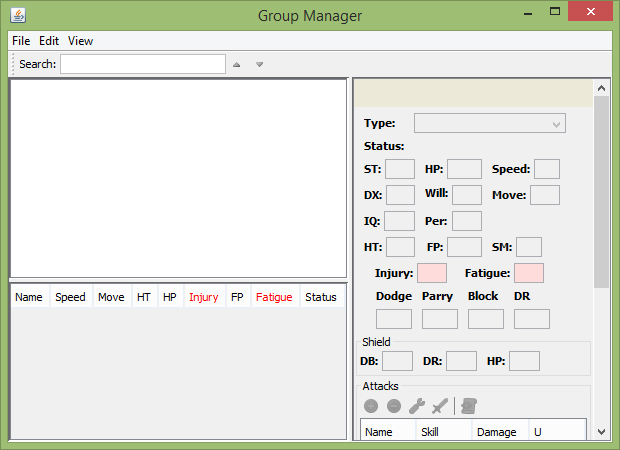
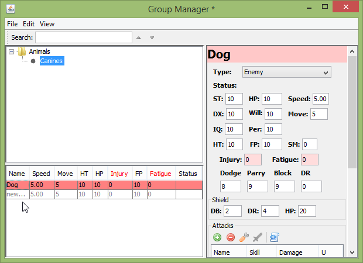
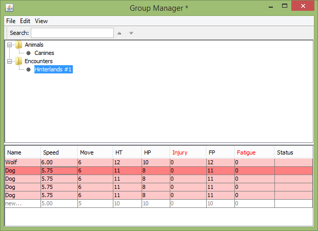
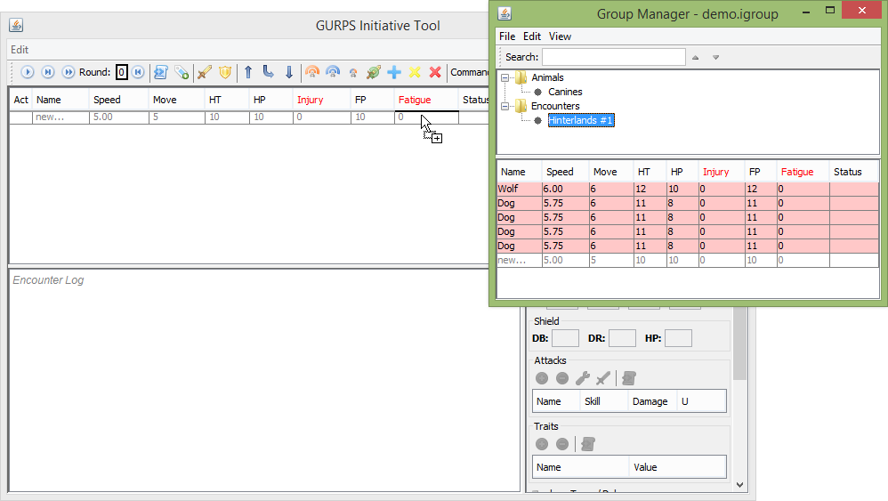
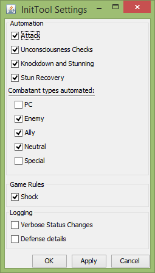
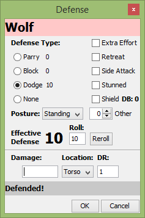
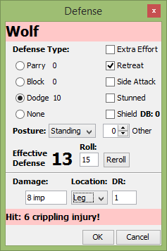
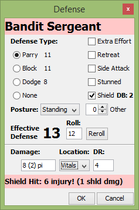
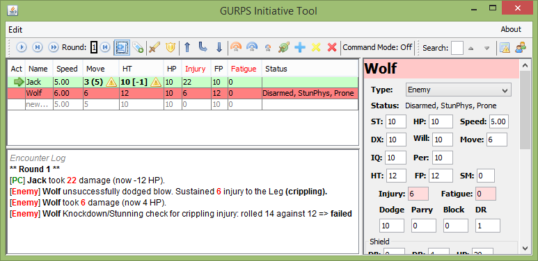
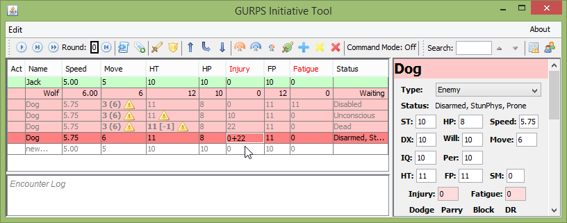

Screenshots
===========

Initial Screen:

.. image:: _static/01_start_screen.png

Right-click Menu:

.. image:: _static/02_right_click.png

Automated Attack:

.. image:: _static/03_combat_attack.png

Defense Dialog:

.. image:: _static/04_defend.png

More Automation:

.. image:: _static/05_automation.png

Group Manager:

Managing Groups:

Managing Combatants:

Copying groups to the initiative table:

Automation options

Defense dialog

Defense results log

Table editing and status formatting

Attacks and Traits detail

.. image:: _static/31_attacks_traits.png

