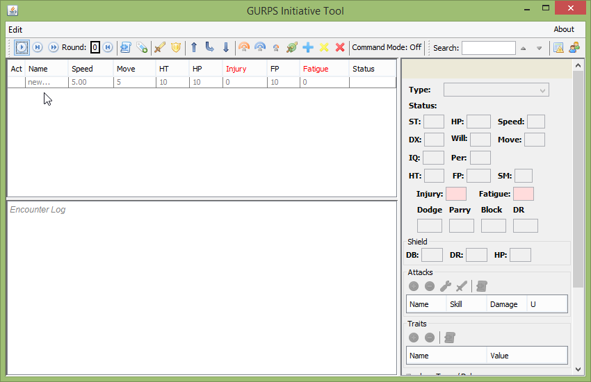
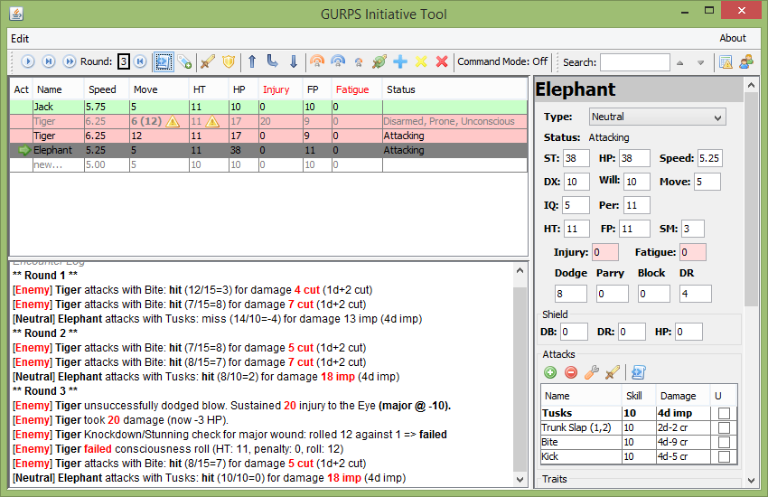

Screenshots
===========

Initial Screen:

Right-click Menu:

.. image:: _static/02_right_click.png

Automated Attack:

.. image:: _static/03_combat_attack.png

Defense Dialog:

.. image:: _static/04_defend.png

More Automation:

Group Manager:

.. image:: _static/10_group_manager.png

Managing Groups:

.. image:: _static/11_new_group.png

Managing Combatants:

.. image:: _static/12_group_copy.png

Copying groups to the initiative table:

.. image:: _static/13_initiative_copy.png

Automation options

.. image:: _static/20_automation_options.png

Defense dialog

.. image:: _static/22_defense_damage.png

Defense results log

.. image:: _static/23_defense_log.png

Table editing and status formatting

Attacks and Traits detail

.. image:: _static/31_attacks_traits.png

